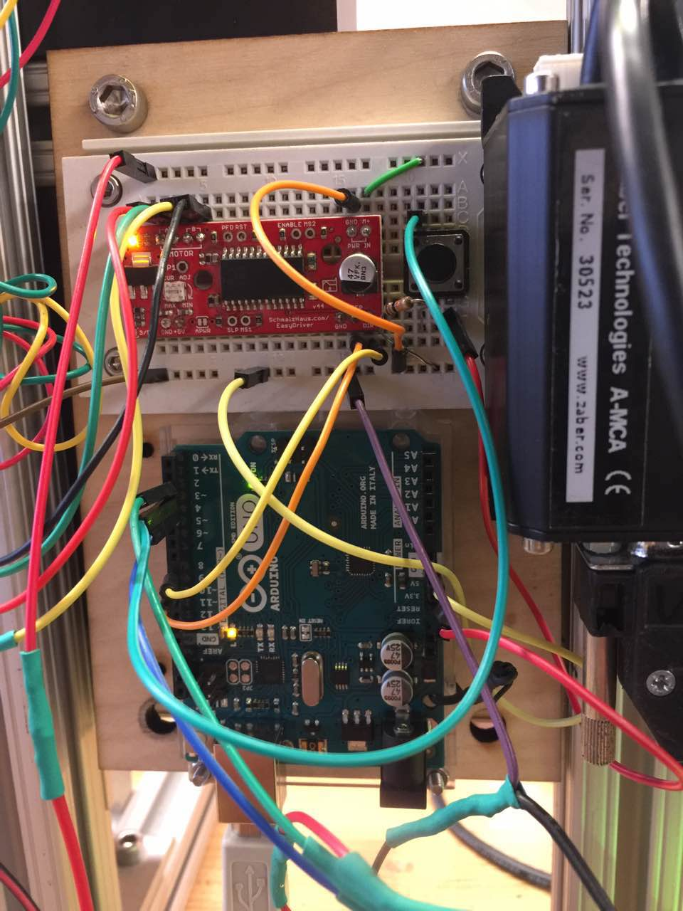

#BarBot

#Automatic Drink Mixing Machine

This system is designed to control the cocktail machine with Zaber Scriptrunner and Arduino. This machine consists of an Arduino Uno, an EasyDriver v4.5 motor driver, an LED strip, a STM100 stepper motor, two Zaber linear stages (500mm and 750mm) and one Zaber lift stage (20mm). The machine will mix up to 4 kinds of alcohols loaded on the drink dispenser to make cocktails. It can stir the drink automatically as well.

# Hardware Required
* Arduino Uno
* EasyDriver v4.5
* STM100 Stepper Motor
* Digital RGB LED Strip -- LPD8806
* Zaber 750mm Linear Stager -- T-LST0750B
* Zaber 500mm Linear Stager -- T-LST0500B
* Zaber 20mm Lift Stager -- VSR20A-T3
* Zaber Dual Axis Stepper Motor Controllers -- A-MCB2
* Zaber Stepper Motor Controller -- A-MCA

# Software Required
* Zaber Console 2.0.10 [Download](http://www.zaber.com/support/software.php?file=zaber_console_installer)

_Note: The ClickOnce version cannot be used_

* Arduino IDE [Download](https://www.arduino.cc/en/Main/Software)
* LPD8806 Library

#Schematic
Stepper Motor Driver:

A-MCB

#Wiring
* EasyDriver -> Arduino
* M+ -> 12V power supply
* GND -> 12V power supply ground & Arduino ground
* Motor A1 -> Red wire on stepper motor
* Motor A2 -> Green wire
* Motor B1 -> Yellow wire
* Motor B2 -> Black wire
* DIR -> Arduino Pin 8
* STP -> Arduino Pin 9
 
  
   
    
     
     
* Button -> Arduino
* Vin -> 3.3V
* GND -> GND on Arduino
* Pin -> Arduino Pin 3

 
  
   
    
     
     
* LED strip -> Arduino
* Power Socket -> 12V power supply
* GND (purple wire) -> Arduino ground
* CLK (green wire) -> Arduino Pin 2
* DATA (blue wire) -> Arduino Pin 4

* Connect two linear stagers (500mm & 750mm) to A-MCB2
* Connect the lift stager to A-MCA
* Connect A-MCA to A-MCB2
* Connect A-MCB2 to computer
* Connect Arduino to computer

# Program pre-setup
* Install Zaber Console [Details &amp; Downloads](http://www.zaber.com/wiki/Software/Zaber_Console)
* Install Integrated USB Driver (Create virtual serial port) [Details &amp; Downloads](http://www.zaber.com/wiki/Software/Integrated_USB_Driver)
* Add the Zaber Console directory to your Windows path.
1. Open System Properties (Win+Pause)
2. Switch to the Advanced tab
3. Click Environment Variables
4. Select PATH in the System variables section
5. Click Edit
6. Add a semicolon to the end of the list and then add Zaber Console's path.
* For example, pretend the path is already this: C:\Program Files\MSOffice
If you installed in the default location, you would change it to this: C:\Program Files\MSOffice;C:\Program Files\Zaber Technologies\Zaber Console 1.2.X
Click OK. Click OK.
* Connect the motor controllers and Arduino to the computer If you haven't
* Check their port names in the device manager
* Change the Arduino's port name in the Port_communication.cs(line 73) and Button_Standby.cs (line 17)
* Change the Zaber Motor Controller's port name in Port_communication.bat (after the /port)
* Do a test run, If you encounter any problems, see the FAQ below (you can test the bat file first).

# How to run the program 
1. Connect the Zaber motor controllers and the Arduino to the computer (USB, their port names may change, please double check the port name in the device manager.)
2. Turn on the power
3. Run Button_Standby.exe
4. Push the button on the breadboard
5. If a new command window prompts out, it means the program has received the signal.
and will execute the script after several seconds.
6. Wait for the whole process. (approx 1 min)
7. If you want to run the program again, just push the button.

#FAQ

##My Bat file prompts a window but it disappears quickly. None of the axes are moving.
* This is usually because of the wrong portal name of the Zaber moter controller. If the port name is wrong, the program cannot open the port successfully. Please check the device manager and set the correct portal name. You can modify the last line of the bat file from "exit" to "pause" to see why the program goes wrong.

##The command line said there is something wrong with the "ScriptRunner.exe.config" file
* Normally, this problem should not prevent the script from running. However, you can fix this problem by replacing that file in your Zaber Console folder with the version in the bin folder.

##The axis did not stop at the correct location
* Please using the Zaber Console to jog the axis to the correct position and using (/0 get pos) in the Advanced Tab to get the position read (unit in data). Then change the position in the bin/Zaber_Script/port_communication.cs(line 83 for dispenser1, line 93 for dispenser2, line 95 for dispenser3, line 97 for dispenser 4).

#References:
* [User Manual for Zaber A-MCB2 Motor Contorller](http://www.zaber.com/wiki/Manuals/A-MCB2)
* [Script Instructions from ZaberWiki](http://www.zaber.com/wiki/Software/Zaber_Console/Scripting)
* [Introduction to Zaber Console](http://www.zaber.com/wiki/Software/Zaber_Console)
* [Online Video that shows how to read serial input from Arduino](https://www.youtube.com/watch?v=TNLp5UV0dMI&t=342s)
* [Online Video that shows how to send serial data to Arduino](https://www.youtube.com/watch?v=WShhcGl3A6g)
* [Online Documentation for the EasyDriver motor driver](http://www.schmalzhaus.com/EasyDriver/)
* [Example on how to use the EasyDriver motor driver](http://www.schmalzhaus.com/EasyDriver/Examples/EasyDriverExamples.html)
* [The Github link to the LED strip libarary](https://github.com/adafruit/LPD8806)
* [The adafruit tutorial on how to use the LED strip](https://learn.adafruit.com/digital-led-strip/overview)
